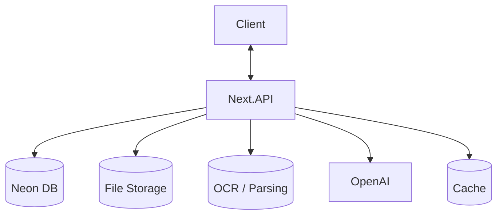
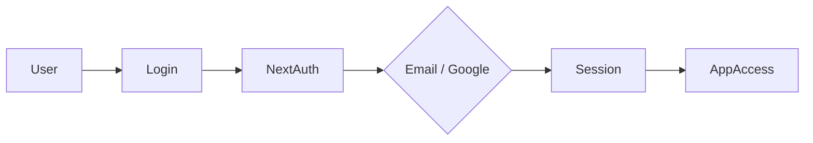
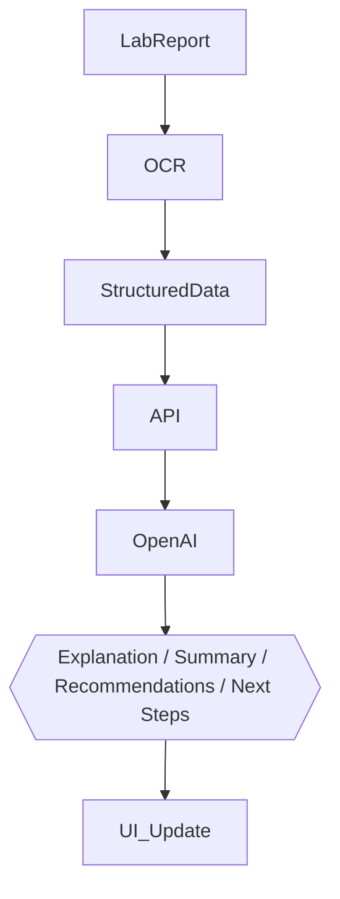

# LabSense AI Project Specifications

🚀 **AI-Powered Lab Report Interpreter** for translating medical test results into plain language, structured health insights, recommendations, and next-step guidance.

---

## 📌 Problem (Core Idea)

Most patients receive lab reports that are:

- Difficult to understand
- Filled with abbreviations and medical jargon
- Missing practical context
- Anxiety-inducing without proper explanation

This leads users to:

- Search random medical terms online
- Misinterpret normal or borderline values
- Miss important warning signs
- Feel confused about what to do next

➡️ **LabSense AI provides ONE intelligent, user-friendly platform that reads lab results, explains them clearly, outlines key findings, and suggests safe next steps.**

---

## 🧑‍⚕️ Users

| Persona               | Needs                                                        |
| --------------------- | ------------------------------------------------------------ |
| Everyday Patient      | Understand lab results in plain English                      |
| Health-Conscious User | Track changes and monitor wellness over time                 |
| Telehealth User       | Prepare better for online doctor consultations               |
| Parent / Caregiver    | Interpret lab reports for children or dependents             |
| Clinics / Labs        | Offer a patient-friendly explanation layer for test results  |

---

## ✨ Core Features

### A) Lab Report Input

Users can submit lab data through:

- PDF uploads
- Images / screenshots
- Manual entry

The system extracts:

- Test names
- Result values
- Units
- Reference ranges
- High / low flags

### B) AI Interpretation

The app translates complex lab values into simple explanations, including:

- What the test measures
- Whether the value is low, normal, high, or critical
- What that may generally suggest
- Contextual explanations in plain language

### C) Result Outline & Summary

The app outlines results into easy-to-understand categories:

- Normal
- Borderline
- Needs Attention
- Urgent Follow-up

It also generates an overall summary of the report.

### D) Recommendations & Suggestions

Based on the results, the app provides safe, non-diagnostic guidance such as:

- Lifestyle suggestions
- Diet-related advice
- Questions to ask a doctor
- Suggested follow-up tests
- Monitoring suggestions

### E) Next Steps Guidance

Examples include:

- “This result may be worth discussing with your doctor.”
- “You may want to repeat this test later depending on symptoms.”
- “This pattern may need medical follow-up.”

### F) Authentication

Secure user access with:

- Email + Password
- Google Sign-In

This allows users to:

- Save reports securely
- Access previous interpretations
- Track history across devices
- Manage their personal health dashboard

### G) Report History & Trends

Users can store previous reports and compare changes over time, such as:

- Cholesterol trends
- Blood sugar changes
- Vitamin deficiencies
- Kidney or liver marker patterns

### H) Export / Share Summary

Generate a clean doctor-friendly report that includes:

- Important findings
- AI summary
- Recommendations
- Questions to discuss with a clinician

### I) Safety Layer

Critical product safeguards include:

- No diagnosis claims
- Confidence-based explanations
- Escalation messaging for dangerous values
- Medical disclaimers throughout the experience

> AI powered by **OpenAI GPT-5 family**

---

## 🗄️ Data Model (Rough Prisma Draft)

> This schema is a starting point and **will evolve**

```prisma
model User {
  id           			String   @id @default(cuid())
  name         			String?
  email        			String   @unique
  password     			String?
  isPro                	Boolean  @default(false)
  stripeCustomerId     	String?
  stripeSubscriptionId 	String?
  reports      			Report[]
  createdAt    			DateTime @default(now())
  updatedAt    			DateTime @updatedAt
}

model Report {
  id          String      @id @default(cuid())
  title       String?
  fileUrl     String?
  rawText     String?
  summary     String?
  uploadedBy  String
  user        User        @relation(fields: [uploadedBy], references: [id])
  results     LabResult[]
  createdAt   DateTime    @default(now())
  updatedAt   DateTime    @updatedAt
}

model LabResult {
  id               String   @id @default(cuid())
  testName         String
  value            String
  unit             String?
  referenceRange   String?
  status           String   // normal | low | high | critical
  explanation      String?
  recommendation   String?
  reportId         String
  report           Report   @relation(fields: [reportId], references: [id], onDelete: Cascade)
  createdAt        DateTime @default(now())
}
```

---

## 🧱 Tech Stack

| Category        | Choice                              |
| --------------- | ----------------------------------- |
| Framework       | **Next.js (React 19)**              |
| Language        | TypeScript                          |
| Database        | Neon PostgreSQL + Prisma ORM        |
| Caching         | Redis (optional)                    |
| File Storage    | Cloudflare R2                       |
| OCR / Parsing   | Tesseract / AWS Textract            |
| CSS/UI          | Tailwind CSS v4 + ShadCN            |
| Auth            | NextAuth v5 (Email + Password, Google) |
| AI              | OpenAI GPT-5 family                 |
| Deployment      | Vercel (likely)                     |
| Monitoring      | Sentry (later)                      |

---

## 💰 Monetization

| Plan | Price    | Limits                       | Features                                                  |
| ---- | -------- | ---------------------------- | --------------------------------------------------------- |
| Free | $0       | Limited monthly reports      | Basic upload, lab explanation, summary                    |
| Pro  | $10/mo   | Higher usage + history       | Full AI suggestions, trends, export, saved report archive |
| B2B  | Custom   | Clinic/lab based             | White-label dashboard, API access, patient report layer   |

> Stripe for subscriptions + webhooks for syncing

---

## 🎨 UI / UX

- Calm, modern, trustworthy medical-style interface
- Mobile-friendly dashboard
- Plain-language focused experience
- Visual health status indicators
- Clean cards for each lab item

### Layout

- **Collapsible sidebar** for history, profile, and saved reports
- Main dashboard with summary, outlined result categories, and recommendations
- Expandable test detail cards

### Responsive

- Mobile drawer navigation
- Touch-friendly upload and report viewing experience

---

## 🔌 API Architecture



---

## 🔐 Auth Flow



---

## 🧠 AI Feature Flow



---

## 🗂️ Development Workflow

- **One branch per feature/module**
- Use **ChatGPT / Copilot / Cursor** for implementation support
- Sentry for runtime monitoring and issue tracking
- GitHub Actions (optional for CI/CD)

**Branch examples**:

```bash
git switch -c feature/authentication
```

---

## 🧭 Roadmap

### **MVP**

- User authentication
- Lab report upload
- OCR extraction
- Result parsing
- Basic AI explanation
- Result summary dashboard

### **Phase 2**

- Recommendations engine
- Trend tracking
- Export / share summary
- Saved history improvements

### **Future Enhancements**

- Clinic dashboard
- Family account / dependent management
- Mobile app
- EHR / lab integrations
- Multilingual interpretation

---

## 📌 Status

- In planning
- Ready for environment setup & UI scaffolding

---

## ⚠️ Compliance & Safety

- HIPAA / GDPR-conscious architecture
- Encrypted storage and secure access
- Clear non-diagnostic disclaimers
- Escalation messaging for critical markers

---

🏥 **LabSense AI — Understand Your Health, Not Just Your Numbers.**
